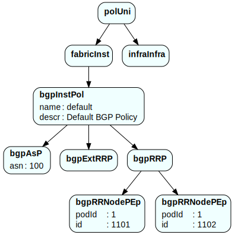

# ACI2DOT

aci2dot converts JSON formatted Cisco ACI policy files or snippets to a [DOT](https://en.wikipedia.org/wiki/DOT_(graph_description_language)) graph format.



## Dependencies

- Python 3 only 
- As [Graphwiz](https://www.graphviz.org) is a heavy package, aci2dot has been designed without it being a depency as long as the option `--dot` is not used.
- When [Graphwiz](https://www.graphviz.org) is installed `--dot {svg,png,pdf}` will also allow rendering the graph in the respective format.

## Customisation

`--write` creates a config file `.aci2dot` in the current directory, which allows for modification of the graph, node and edge properties.

The default config is as following:
```
  graph [
    size="8.27";
    ratio="1";
    nodesep="0.15";
    ranksep="0.5"; 
    #splines="false"; 
    #rankdir=LR;
    bgcolor="transparent";
  ];
  node [
    shape=box;
    style="rounded,filled";
    fillcolor=AZURE;
    fontname=Helvetica;
  ]
  edge [
    #arrowsize=0.5;
  ]
```

## Full usage

```
./aci2dot.py --help
usage: aci2dot.py [-h] [--nr] [--na] [--write]
                  [--stdout | --dot {svg,png,pdf}]
                  policy_file

Create DOT formatted Graph from JSON formatted ACI policy export.

positional arguments:
  policy_file          JSON ACI Policy Filename

optional arguments:
  -h, --help           show this help message and exit
  --nr                 Suppress redundant children
  --na                 Don't show attributes
  --write              Write config template to .aci2dot and exit
  --stdout             Write to STDOUT instead of to file
  --dot {svg,png,pdf}  Also write SVG/PNG/PDF. 'dot' needs to be installed.
```

## Example

The example graph above was rendered from:

```json
{
  "polUni": {
    "attributes": {
      "status": "created,modified"
    },
    "children": [{
      "fabricInst": {
        "attributes": {
          "status": "created,modified"
        },
        "children": [{
          "bgpInstPol": {
            "attributes": {
              "status": "created,modified",
              "ownerKey": "",
              "name": "default",
              "descr": "Default BGP Policy",
              "nameAlias": "",
              "ownerTag": "",
              "annotation": ""
            },
            "children": [{
              "bgpAsP": {
                "attributes": {
                  "status": "created,modified",
                  "name": "",
                  "descr": "",
                  "asn": "100",
                  "nameAlias": "",
                  "annotation": ""
                }
              }
            }, {
              "bgpExtRRP": {
                "attributes": {
                  "status": "created,modified",
                  "annotation": "",
                  "name": "",
                  "descr": "",
                  "nameAlias": ""
                }
              }
            }, {
              "bgpRRP": {
                "attributes": {
                  "status": "created,modified",
                  "annotation": "",
                  "name": "",
                  "descr": "",
                  "nameAlias": ""
                },
                "children": [{
                  "bgpRRNodePEp": {
                    "attributes": {
                      "status": "created,modified",
                      "descr": "",
                      "podId": "1",
                      "annotation": "",
                      "nameAlias": "",
                      "id": "1101"
                    }
                  }
                }, {
                  "bgpRRNodePEp": {
                    "attributes": {
                      "status": "created,modified",
                      "descr": "",
                      "podId": "1",
                      "annotation": "",
                      "nameAlias": "",
                      "id": "1102"
                    }
                  }
                }]
              }
            }]
          }
        }]
      }
    }, {
      "infraInfra": {
        "attributes": {
          "status": "created,modified"
        }
      }
    }]
  }
}
```
